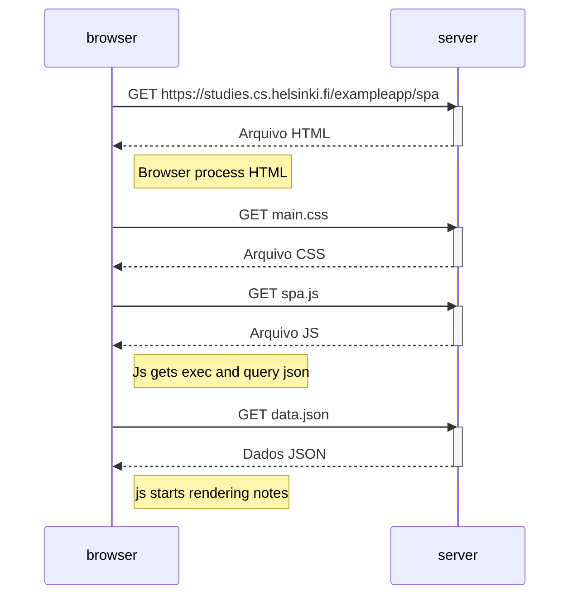

```mermaid
sequenceDiagram
    participant browser
    participant server
    
    browser->>server: GET https://studies.cs.helsinki.fi/exampleapp/spa
    activate server
    server-->>browser: Arquivo HTML
    deactivate server
    
    Note right of browser:Browser process HTML
    
    browser->>server: GET main.css
    activate server
    server-->>browser: Arquivo CSS
    deactivate server
    
    browser->>server: GET spa.js
    activate server
    server-->>browser: Arquivo JS
    deactivate server
    
    Note right of browser: Js gets exec and query json
    
    browser->>server: GET data.json
    activate server
    server-->>browser: Dados JSON
    deactivate server
    
    Note right of browser: js starts rendering notes

```
